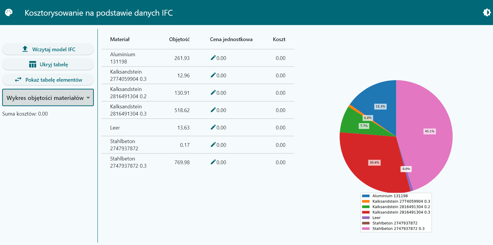
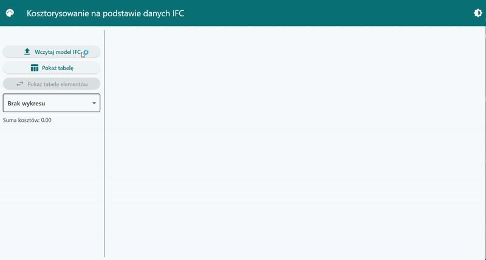
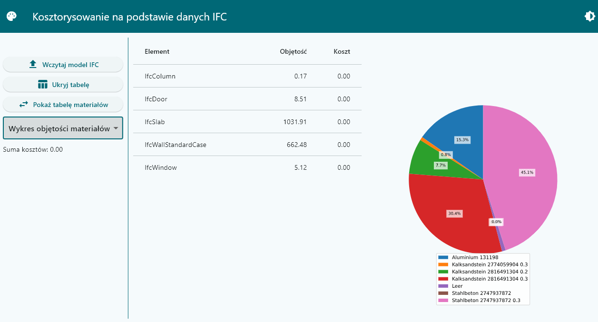
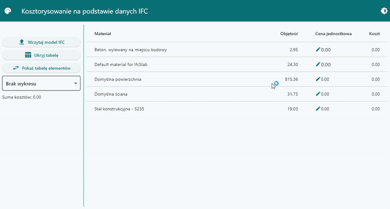
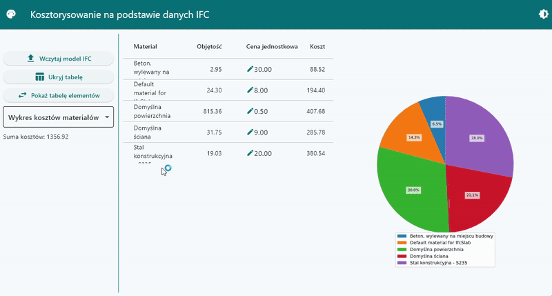
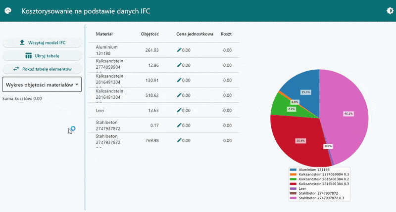

# Aplikacja do kosztorysowania BIM



Aplikacja desktopowa napisana w Pythonie, która generuje kosztorysy na podstawie modeli BIM (Building Information Modeling) wykorzystując pliki IFC. Projekt został opracowany w ramach kursu Technologia BIM.

## Spis treści
- [Czym jest BIM?](#czym-jest-bim)
- [Czym jest IFC?](#czym-jest-ifc)
- [Opis projektu](#opis-projektu)
- [Funkcjonalności](#funkcjonalności)
- [Instalacja](#instalacja)
- [Użytkowanie](#użytkowanie)
- [Szczegóły implementacji](#szczegóły-implementacji)
- [Wykorzystane technologie](#wykorzystane-technologie)

## Czym jest BIM?

Building Information Modeling (BIM) to cyfrowa reprezentacja fizycznych i funkcjonalnych cech obiektu budowlanego. W przeciwieństwie do tradycyjnych rysunków 2D, BIM umożliwia tworzenie szczegółowych modeli 3D zawierających kompleksowe informacje o każdym elemencie budynku. Takie podejście pozwala na:

- Lepszą wizualizację i koordynację projektu
- Wykrywanie kolizji przed rozpoczęciem budowy
- Dokładne zestawienia materiałów
- Zarządzanie cyklem życia obiektu budowlanego
- Usprawnioną współpracę między architektami, inżynierami i wykonawcami

BIM transformuje branżę AEC (Architecture, Engineering, and Construction), usprawniając procesy i ograniczając błędy poprzez scentralizowane, bogate w dane środowisko projektowe.

## Czym jest IFC?

Industry Foundation Classes (IFC) to otwarty, znormalizowany format danych używany do opisu, wymiany i udostępniania informacji o danych z branży budowlanej. Kluczowe aspekty to:

- **Format neutralny względem producentów**: IFC umożliwia wymianę danych między różnymi aplikacjami
- **Standard ISO**: Uznawany międzynarodowo (ISO 16739-1:2018)
- **Bogata struktura danych**: Zawiera nie tylko informacje geometryczne, ale również właściwości, relacje i metadane
- **Znaczenie semantyczne**: Elementy w IFC "wiedzą" czym są (np. ściana "wie", że jest ścianą)

Pliki IFC służą jako wspólny język dla BIM, umożliwiający interoperacyjność niezależnie od oprogramowania użytego do stworzenia modelu.

## Opis projektu

Aplikacja przetwarza pliki IFC w celu wyodrębnienia informacji o materiałach i elementach, oblicza koszty budowy na podstawie cen materiałów oraz prezentuje dane przez interaktywny interfejs. Program pomaga profesjonalistom z branży budowlanej szybko generować kosztorysy z modeli BIM bez ręcznego tworzenia zestawień ilościowych.

## Funkcjonalności

- **Import plików IFC**: Wczytywanie i przetwarzanie modeli budynków w formacie IFC  
  

- **Automatyczne wykrywanie elementów**: Wyodrębnianie elementów, materiałów i objętości  
  

- **Obliczanie kosztów**: Przypisywanie cen materiałów i obliczanie całkowitych kosztów  
  

- **Interaktywna wizualizacja danych**: Prezentacja kosztów według materiału lub typu elementu za pomocą wykresów kołowych  
  

- **Zarządzanie cenami materiałów**: Aktualizacja cen materiałów i obserwacja zmian kosztów w czasie rzeczywistym  

- **Motyw jasny/ciemny**: Przełączanie między różnymi motywami interfejsu
  

- **Dostosowanie kolorów**: Wybór spośród wielu schematów kolorystycznych  
  


## Instalacja

1. Sklonuj to repozytorium:
```
git clone https://github.com/BartoszKog/aplikacja-kosztorys-bim.git
cd aplikacja-kosztorys-bim
```

2. Zainstaluj zależności:
```
pip install -r requirements.txt
```

3. Uruchom aplikację:
```
flet run src/main.py
```

## Użytkowanie

1. Uruchom aplikację
2. Kliknij przycisk "Wczytaj plik IFC" i wybierz swój model IFC
3. Przejrzyj wyodrębnione materiały i typy elementów
4. Dostosuj ceny materiałów według potrzeb
5. Zobacz podział kosztów według materiału lub typu elementu

> **Informacja**: Dla celów testowych w repozytorium umieszczono przykładowe pliki IFC:
> - `AC20-Institute-Var-2.ifc`: Model instytutu
> - `example_file.ifc`: Przykładowy prosty model
>
> Możesz wykorzystać te pliki do przetestowania aplikacji bez konieczności posiadania własnych modeli BIM.


## Szczegóły implementacji

Aplikacja ma strukturę modułową:

- `main.py`: Punkt wejściowy aplikacji
- `app_layout.py`: Definicja układu UI i zarządzanie motywami
- `ifc_data.py`: Główna logika przetwarzania IFC przy użyciu IfcOpenShell
- `body.py`: Implementacja głównego obszaru zawartości
- `controls_column.py`: Implementacja kontrolek w pasku bocznym
- `table.py`: Komponenty tabel danych
- `pie_chart.py`: Komponenty wizualizacji
- `shared_resources.py`: Współdzielenie danych między komponentami

## Wykorzystane technologie

- **Python**: Główny język programowania
- **Flet**: Framework UI bazujący na Flutterze
- **IfcOpenShell**: Biblioteka open-source do przetwarzania IFC
- **Pandas**: Manipulacja i analiza danych
- **GitHub Copilot**: Wsparcie AI przy implementacji złożonego kodu

## Licencja

Ten projekt jest dostępny na licencji MIT.